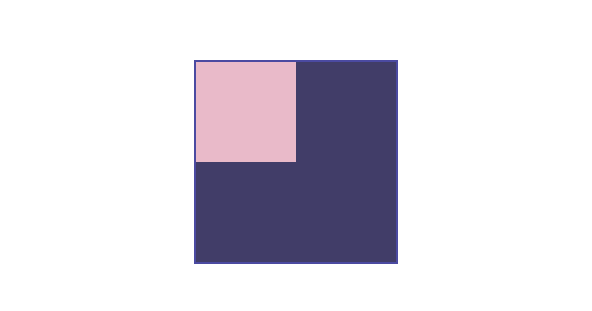
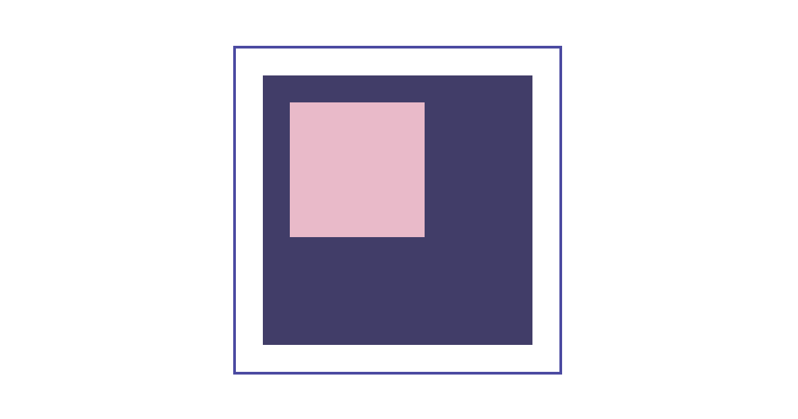

# Margin VS Padding in CSS

## **Intro**
This article will refresh your knowledge about margin and padding in CSS, it's projected to beginner that's still unsure about the difference between margin and padding.

---

## **So what is margin and padding then?**
The official definition goes like this:
> **Margin** properties are used to create space around elements, outside of any defined borders. 
> 
> **Padding** properties are used to generate space around an element's content, inside of any defined borders.

To make it a little bit clearer let's say the distance between your skin to other people's skin is called ***Margin*** because it has different parent (body). and the distance between your skin to your bone is called ***Padding*** because it has the same parent (body).

---

## **Syntax**

Add 10px margin to the top, right, left, and bottom of the element:
> margin: 10px 

Add 10px margin to the top and bottom, AND 20px margin to the right and left:
> margin: 10px 20px

Add 10px margin to the top, 5px to the right, 8px to the bottom and 2 px to the left (clockwise):
> margin: 10px 5px 8px 2px

This one is the same as above but its using individual property:
> margin-top: 10px 
>
> margin-right: 5px 
> 
> margin-bottom: 8px 
> 
> margin-left: 2px

For **padding**, is pretty much the same, you only need to change the "margin" keyword into "padding".

---

## **Example**

We'll create simple example to better understand the concept about margin and padding.

let's create HTML Structure like this:
```html
<div class="main">
  <div class="container">
    <div class="outer-item">
      <div class="inner-item"></div>
    </div>
  </div>
</div>
```

And initial CSS like this:
```css
.container {
  border: 2px solid #4a47a3;
}

.outer-item {
  background-color: #413c69;
  width: 200px;
  height: 200px;
}

.inner-item {
  background-color: #eab9c9;
  width: 100px;
  height: 100px;
}
```

Your app will look like this:

Nothing special in CSS file right now, we just adding border for `.container`, adding width and background color for `.outer-item` and `.inner-item`.


Then let's try adding margin in our css file:
```css
.outer-item {
  background-color: #413c69;
  width: 200px;
  height: 200px;

  /* Add margin */
  margin: 20px
}
```

now your app should look like this:

Look, I add 20px margin for `.outer-item` and it create spaces around it. Imagine the `.outer-item` push **outside** the top, right, bottom and left of its element to create space.

Now let's add padding to our CSS:
```css
.outer-item {
  background-color: #413c69;
  width: 200px;
  height: 200px;
  margin: 20px;

  /* Add Padding */
  padding: 20px;
}
```

Now your app will look like this:

By adding 20px padding, it tells `.outer-item` to push the `.inner-item` 20px from top, right, bottom and left.

**BUT** did you find the behaviour weird ? The element keep getting bigger everytime you add a margin or a padding because the default behaviour is adding the padding and margin into our element.

so in this case element `.outer-item` is calculated to have 200px (width) + 20px (padding) + 20px (margin) = **220px for both width and heights!!**. 

In many case you don't want those behaviour, trust me in this 😅.

To fix those unwanted behaviour, you could use property `box-sizing: border-box`. Just add this code on the top of your css file:
```css
*, *::before, *::after{
  box-sizing: border-box;
}
```

Your element will look like this:


This result is the one you probably wanted, because it will not make your element wider or longer by adding margin or padding. 

What `box-sizing: border-box` do is simply include padding and border in the element's total width and height. So it calculated like this **160px (width) + 20px (margin) + 20px (padding) = 200px**.

---

That's it for margin and padding!, hope now you grasp the concept of it by now!. 

If you have any request for additional material, leave in the comment below. See you on next CSS related content ! -D